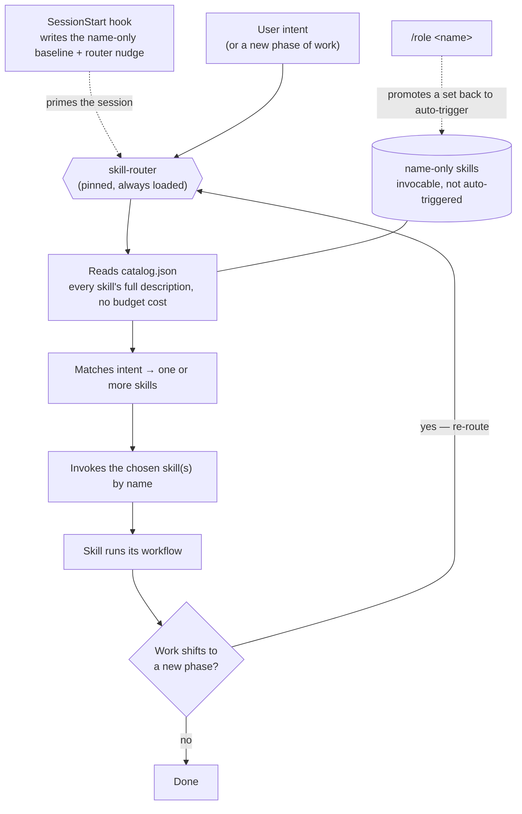

# Roles & activation model

This library uses a **name-only baseline with an active orchestrator** so that a
large skill set stays reliable on any context window.

**Orchestrator-routed activation is a core feature in its own right** — not just a
way to manage cropping. The `skill-router` deterministically selects and invokes the
right skill from a full catalog, so activation **does not depend on Claude's
description-based auto-triggering** (which is probabilistic and degrades as the skill
set grows). Routing both eliminates cropping *and* makes activation predictable and
testable — the repo ships a routing-eval harness ([EVALS.md](EVALS.md)) to keep it
honest. The source of truth is [`roles.json`](../roles.json); the catalog and
marketplace are generated from it.

## The problem this solves

Claude Code injects each installed skill's `name`+`description` into a per-session
listing capped at `skillListingBudgetFraction` (**1% of the context window** —
only ~20–22 descriptions fit on a 200k window). Past the cap it **drops the
least-recently-used descriptions arbitrarily**, silently stripping the keywords
skills need to auto-trigger. With 40+ skills, description-based triggering becomes
unreliable and uncontrolled.

## How it works

- **Pinned skills stay `on`** (full description, auto-trigger): the `skill-router`
  orchestrator plus the safety Iron-Law skills — `verification-before-completion`,
  `tdd-workflow`, `bug-investigating`, `incident-response`, `code-reviewing`.
- **Every other skill is `name-only`**: listed by name, still invocable, but it
  does **not** auto-trigger and its description costs ~nothing. The listing never
  overflows, so the window size is irrelevant.
- **The orchestrator activates the rest.** `skill-router` reads the generated
  `catalog.json` (every skill's full description, with no budget pressure), matches
  your intent, and **invokes the chosen skill by name**. This replaces ~40 fragile
  description matches with one reliable router (kept `on`, reinforced by the
  SessionStart hook nudge, always available as `/skill-router`). Routing — not
  auto-trigger — is the activation path the library relies on.
- **Roles promote a working set back to `on`.** Activating a role flips its skills
  to auto-trigger for direct, one-hop use of your daily set.

| `skillOverrides` value  | In listing | Auto-triggers | User-invocable |
|-------------------------|------------|---------------|----------------|
| `on` (default)          | name+desc  | yes           | yes            |
| `name-only`             | name only  | no            | yes            |
| `user-invocable-only`   | hidden     | no            | yes (`/name`)  |
| `off`                   | hidden     | no            | no             |

`skillOverrides` and the listing **hot-reload** when `settings.local.json`
changes, so the baseline and role switches apply without a restart.

## Routing flow



The router is the only decision point: it draws from the full catalog (not the
budget-limited listing), invokes by name, and is re-entered every time the work
changes phase. A role just flips part of the name-only pool back to auto-trigger for
direct one-hop use.

## What routing looks like in a session

The router isn't a one-time gate — Claude re-consults it as the *kind* of work
changes, so each phase loads only the skill it needs. A single feature might play out
like this:

```text
you ▸ "Add OAuth login to the API."

       ┌─ skill-router ──────────────────────────────────────────────┐
phase  │ matches intent → invokes by name                            │
───────┼─────────────────────────────────────────────────────────────┤
plan   │ → feature-planning      scope tasks, acceptance criteria      │
design │ → architecture-design   ADR: session vs token, where auth lives
       │ → data-modeling         user/session schema + migration       │
build  │ → tdd-workflow          red → green → refactor                │
review │ → security-audit  +  code-reviewing   (fan-out: one prompt,   │
       │                                        two skills)            │
ship   │ → deployment-checklist  pre-deploy safety + rollback          │
       └─────────────────────────────────────────────────────────────┘

# A new phase later in the session re-routes — the testing skill wasn't
# loaded an hour ago, so the router fetches it now:
you ▸ "Now add tests for the token-refresh edge cases."
       → skill-router → test-suite-design

# Working in one hat all session? Promote the set so it auto-triggers:
you ▸ /role backend
       backend skills now auto-trigger; everything else stays one route away.
```

Two things to notice: a single request can **fan out** to several skills
(`security-audit` *and* `code-reviewing`), and a later phase **re-routes** to a skill
that wasn't loaded earlier — which is exactly why routing beats one-shot
auto-triggering at this scale.

## Two ways to avoid cropping (and where each works)

Cropping has exactly two cures, and which install method you pick comes down to which
one a given surface can use:

1. **Name-only baseline (lever ①)** — keep descriptions out of the listing for all but
   the pinned set. Scales to any number of skills. But it *is* `skillOverrides`, and
   **`skillOverrides` only affects skills under `.claude/skills/`** (personal / project
   / enterprise level). Applying it is a settings write — done by the installer and
   re-asserted by the hook. Works where settings + hooks run: **CLI and Cowork.**
2. **Small install (lever ②)** — install fewer skills than the budget (~20). Weaker (it
   caps your working set) but needs no settings, so it works **everywhere**, including
   Claude Code on the web and claude.ai chat. This is exactly what a per-role plugin does.

### Why plugins can't carry the baseline

Per the Claude Code docs, **"Plugin skills are not affected by `skillOverrides`."** No
plugin setting and no hook can mark a plugin's skills name-only — the only visibility
control for a plugin's skills is enabling/disabling the plugin. So a single
"everything" plugin would inject all 40+ descriptions and crop on *every* surface, CLI
included. That's why the full library ships via the **installer** (lever ①) and the
marketplace ships **per-role plugins** (lever ②), each small enough to fit — and why
the per-role plugins omit `skill-router` (with no baseline to route around, and no
catalog it could read, it would only waste a listing slot).

## Roles

| Role key   | Persona                          | Core      |
|------------|----------------------------------|-----------|
| `backend`  | Backend / Full-stack Engineer    | technical |
| `frontend` | Frontend Engineer                | technical |
| `devops`   | DevOps / SRE / Platform Engineer | technical |
| `ml`       | ML Engineer / MLOps              | technical |
| `ai`       | AI Engineer (LLM apps)           | technical |
| `data`     | Data Engineer                    | technical |
| `security` | Security Engineer                | technical |
| `architect`| Architect / Staff Engineer       | technical |
| `em`       | Engineering Manager / Tech Lead  | universal |
| `pm`       | Product / Project Manager        | universal |
| `strategy` | Strategy / Founder Review        | universal |
| `qa`       | QA / Test Engineer               | technical |
| `mobile`   | Mobile Engineer                  | technical |
| `designer` | Designer / UX                    | universal |

A role's working set = its **core** ∪ its own skills. Cores: **universal** =
`skill-router`, `brainstorming`, `feature-planning`; **technical** =
`skill-router`, `feature-planning`, `plan-execution`, `git-workflow`,
`code-reviewing`, `verification-before-completion`, `bug-investigating`,
`project-documentation`. Inspect with `node scripts/resolve.mjs skills <role>`
or list roles with `node scripts/resolve.mjs roles`. Promoted-set sizes stay at
or under the ~20-description crop cap (`backend` and `devops` both sit exactly
at 20 — any addition to either, or to the technical core, forces a trim or a
role split first). `subagent-orchestration` is deliberately role-less
(`meta_only`, like `writing-skills`): it's a way of working, not a hat — always
one route away.

## Install (CLI — the full dynamic model)

This is the only path that delivers the **whole library** without cropping, because
the name-only baseline (`skillOverrides`) applies only to skills in `.claude/skills/`
— see [Why plugins can't carry the baseline](#why-plugins-cant-carry-the-baseline).

The installer is **pure Node** — the runtime Claude Code already requires — so these
commands run unchanged on **Linux, macOS, and Windows** (no bash, Python, or `sed`).

```bash
node install.mjs                     # all skills + machinery + hook + baseline -> ./.claude/
node install.mjs --global            # ...to the user config dir
node install.mjs --no-hook           # skip the hook (baseline still applied at install)
node install.mjs --role pm           # hard subset: just the PM skills (no orchestrator gating)
node install.mjs --role pm --prune   # ...and drop other library skills from a prior install
```

The default installs **all** skills plus the machinery (catalog/role markers,
`resolve.mjs`, the `/role` command), **applies the name-only baseline** to
`settings.local.json` immediately, and installs the SessionStart hook. Because the
baseline is written at install time and `skillOverrides` persists, the install is
**crop-safe right away** — even before you wire the hook, and with `--no-hook`. The
hook (on by default) **re-asserts** the baseline on every session boundary
(`startup|resume|clear|compact`), emits `reloadSkills`, and injects the router
nudge — needed because the skill listing isn't re-injected after `/compact`. The
installer prints the `settings.json` snippet to enable it; it never edits your settings.

Re-running install is idempotent: each skill is re-copied cleanly (no stale
leftover files). `--prune` additionally removes previously-installed library skills
outside the new selection (never your own custom skills). `--global` resolves to
`$CLAUDE_CONFIG_DIR` when that env var is set, else `~/.claude`; explicit `--dir`
always wins.

### Uninstall

```bash
node uninstall.mjs                   # remove from ./.claude/
node uninstall.mjs --global          # ...from the user config dir
node uninstall.mjs --dry-run         # preview only
```

Removes only what the installer created (this repo's skills, the catalog/role
markers, `resolve.mjs`, the hook script, the `/role` command) and prunes the
library's `skillOverrides` from `settings.local.json`. It prompts first (`--yes` to
skip) and prints the `SessionStart` block to delete from `settings.json` — which it
never edits. The `.active-role` marker is only written by `--role` (and rewritten by
`/role`); `/role all|none` and `uninstall.mjs` clear it.

### Switch roles at runtime

```text
/role            # show the active role + list roles
/role backend    # promote the backend set to auto-trigger
/role all        # reset to baseline (only pinned skills auto-trigger)
```

`/role` rewrites `settings.local.json` (hot-reloads) and records the choice in an
`.active-role` marker so the hook re-asserts it across compaction.

## Install (plugins — the recommended, cross-surface path)

For everywhere hooks don't run — **Claude Code on the web, claude.ai chat, and
Cowork** — and as the simplest managed install on the CLI too, the repo is a
marketplace of **per-role plugins**. Each is a hard subset (lever ②), so the subset
*is* the scope: small enough to never crop, no orchestrator or baseline needed.
Generated from `roles.json` by `scripts/build-plugins.mjs` into
[`.claude-plugin/marketplace.json`](../.claude-plugin/marketplace.json) and `plugins/`
(do not edit by hand).

```text
/plugin marketplace add SWEStash/swe-workflow-skills
/plugin install swe-workflow-pm@swe-workflow
```

In **claude.ai chat** the same marketplace is added from Customize → Plugins (Team/
Enterprise admins can distribute it org-wide); bundled **skills and slash-commands
work**, while **hooks and sub-agents are greyed out** (Cowork-only). On **Claude Code
web**, plugins and skills load but **hooks don't run** — which is exactly why these
are per-role subsets rather than one full-library plugin (see
[Why plugins can't carry the baseline](#why-plugins-cant-carry-the-baseline)).
Verified against the Claude Code / claude.ai docs, 2026-06.

## Roadmap: roles and skills (future iterations)

All need **new skills** first (build via the `writing-skills` RED→GREEN process),
in planned order:

1. **Deferred roles** — **Data Scientist** (needs EDA / statistical-analysis /
   notebook-to-production skills); possible `backend`/`devops` splits (both at
   the 20-description cap).
2. **Machinery** — **router scaling** (see follow-ups below) is the remaining
   item. Done 2026-07 (Phase 8a/8b): the `description` + `when_to_use` split is
   supported by the toolchain with a **lazy per-touch migration** (no big-bang —
   9 skills migrated so far, catalog byte-identical each time); `context: fork`
   applied to the four heavy review skills; the **obsolescence review** is now a
   standing policy (AUTHORING.md § Obsolescence review: slim first, retire late)
   with its first pilot complete (below).

_Obsolescence pilot 2026-07 (Phase 8b) — 6 of the oldest task-like skills, 14
eval cases on the opus-pinned workflow-runner. **Slimmed**: `effort-estimation`
(RED ≈ GREEN on 3 samples of both evals; 95 → 54 lines; GREEN ≥ RED held
post-slim). **Kept**: `project-documentation` (+5 on the API-docs eval; its
changelog eval caught a real over-deflection to `release-management` — fixed,
GREEN 0/6 → 6/6), `configuration-strategy` (boundary eval +2),
`retrospective` (GREEN ≥ RED in all 6 samples, mean +1.3),
`metrics-and-okrs` (+2), `project-proposal` (+2). **Calibrated cost** for
future sweeps: ~97k subagent tokens per eval case-run (4 opus agents — 2
generators + 2 judges); the 6-skill baseline = 56 agents / ~1.36M tokens /
~4.5 min wall-clock; the full pilot with ×3 re-samples and post-edit
confirmations = 112 agents / ~2.7M tokens; the routing spot-check adds ~316k
haiku tokens for a 12-case neighborhood. **Finding**: 4 of the 6 pilot skills
predate the 3-eval rule and carry only 2 evals (`effort-estimation`,
`retrospective`, `metrics-and-okrs`, `project-proposal`) — each needs a
scope-boundary eval added when next touched._

_Done 2026-07: **AI & data** — `ai-evaluation`, `llm-app-engineering`,
`data-pipeline-design`, `data-quality` shipped with the new `ai` and `data`
roles; `ml` extended with `ai-evaluation`. **Ideation & execution** —
`brainstorming` (universal core), `plan-execution` (technical core, hardened),
`threat-modeling` (→ `security`), `build-vs-buy` (→ `strategy`).
**Governance & ops** — `compliance-privacy` (→ `security`),
`finops-cost-optimization` (→ `strategy`), `code-archaeology` (→ `architect`),
`resilience-engineering` (→ `devops`). **DX & verification** — `dx-audit`
(→ `em`), `browser-verification` (→ `frontend`, `qa`), `subagent-orchestration`
(meta_only). **Mobile** — `mobile-architecture` + `mobile-release` with the new
`mobile` role._

## Open follow-ups

- The two largest roles (`backend` 20 after `plan-execution` joined the
  technical core; `devops` 20 after `resilience-engineering`) both sit AT the
  ~20 listing cap — `release-management` joined `devops` in place of
  `dependency-impact-analysis` (still in `architect`, always routable) to stay
  crop-safe; `backend` deliberately did NOT get it (route via `skill-router`).
  Neither has headroom left: the next addition to either, or to the technical
  core, forces a trim or a role split.
- **Router scaling (haiku)**: `skill-router` runs on haiku and reads the whole
  `catalog.json` per routing call — the catalog is a context budget of its own.
  At 62 skills it's ~32k chars (~8k tokens): no window pressure (200k), but a
  real per-call cost and a growing candidate set. Standing mitigations:
  the ~350–550-char description discipline (now machine-checked —
  `build-plugins.mjs` errors above the 1,024 platform cap, warns above 600
  chars/description and above 48k chars total catalog), terse one-line phase-index
  entries in the router, and role-scoped routing (lead with the active role's
  set). **Adaptation trigger**: when the total-catalog warning fires (~90+
  skills at current discipline) or routing accuracy degrades in the eval
  baseline, implement two-stage routing — the router shortlists from its
  compact phase index (or a generated name+gist index), then reads only the
  shortlisted skills' full descriptions instead of the whole catalog. Haiku
  routes mostly on names (EVALS.md finding), so the compact first stage should
  hold accuracy; verify with the routing harness before switching.
- Pinned set reviewed 2026-07 (re-reviewed with the Phase-2 AI/data and Phase-3
  ideation/execution additions): unchanged. `release-management` is
  high-consequence but, like `deployment-checklist` and `rollback-strategy`, it
  activates at a deliberate moment the router catches reliably — pinning is
  reserved for skills that must interrupt work the agent already believes is
  fine (verification, TDD, bugs, incidents, review). `plan-execution` was the
  serious Phase-3 candidate (its Iron Law interrupts unverified "done"s), but
  its entry moment ("execute this plan") is deliberate and router-visible, the
  already-pinned `verification-before-completion` covers the false-"done"
  failure mode per claim, and it now rides in the technical core for every
  engineering role — pinning it would spend listing budget on redundancy.
- Decide whether to keep committing generated `plugins/` + `catalog.json` or
  generate them at release.

_Resolved: per-role plugins no longer bundle `skill-router` (it can't route without a
catalog or baseline); the `claude.ai/code` + chat plugin story is verified above._
